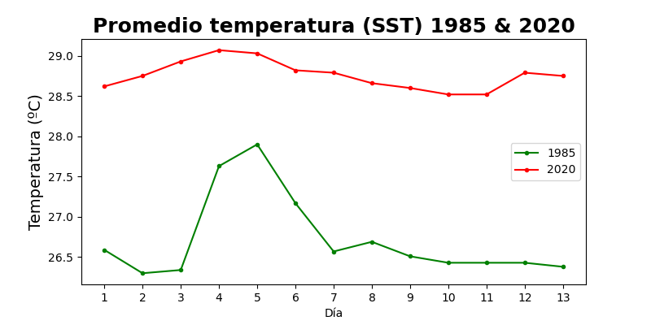
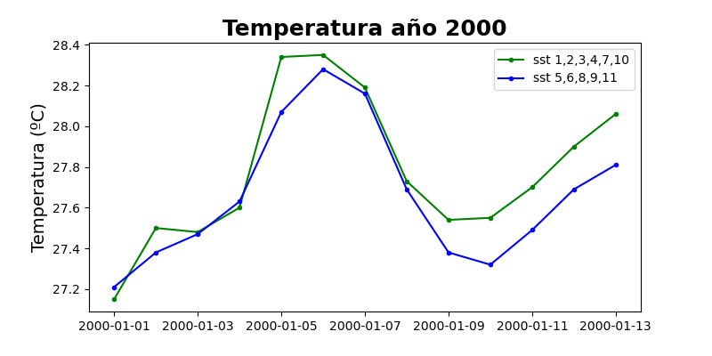

## Resumen

La facilidad para acceder a datos físicos del océano ha mejorado notoriamente y en la actualidad son accesibles a tiempo real. 

STT como se le conoce en inglés (Sea Surface Temperature) es quizá una de las métricas con mayor registro a través del tiempo. Es posible encontrar datos de temperaturas del mar de la década de los años 80's, incluso en algunos casos de los 70´s.

Los mecanismos actuales son muy confiables y son varios los objetos que se encargan de tomar estos registros. Tanto a nivel satelitel para despues ser validados por boyas u objetos que estan en "contacto" mas estrecho son un ejemplo.

Debido a la gran cantidad de datos espacio-temporal de temperaturas superficiales del mar, la mejor forma de para extraer informacion relevante, visualizarla y hacer pronosticos es mediante ciencia de datos.

El proposito es tomar datos de decadas pasadas y cuantificar cuanto ha aumentado la temperatura en el parque nacional marino Corales del Rosario en Colombia, caracterizado por una cobertura alta de especies coralinas pero que en los ultimos años ha disminuido debido a enfermedades (blanqueamiento) producidas por las altas temperaturas del mar.

De igual forma se haran pronosticos o predicciones a partir de las temperaturas para saber como se comportará esta variable a futuro. 

Todo lo anterior se realizara con métodos de ciencia de datos a traves de Python o librerias(frameworks) de Machine Learning como PyTorch o Prophet de Facebook.

### Pre-requisitos

- Pandas basico
- Fundamento de datos **espacio-temporales**

## Datos

### Google Earth Engine (GEE)

Si está familizarizado con Google Earth, esta herramienta es quizá muchisimo mas funcional, agrupando un catalogo extremadamente completo de imagenes satelitales y datasets.

Para usarlo solo es necesario tener una cuenta de Google y [registrarse.](https://earthengine.google.com)

Una vez inscrito puede revisar los datasets de interes. Cada uno tiene su ejemplo ya sea para trabajar con el editor de codigo de JavaScript o la API de Python. Vale la pena revisar la documentacion y fortalecer conceptos.

El dataset usado para colectar las SST o temperaturas superficales del mar es el de la [NOAA](https://developers.google.com/earth-engine/datasets/catalog/NOAA_CDR_OISST_V2_1)

En este [repositorio de GitHub](https://github.com/grammaloreto/EarthEngine/blob/main/NOAA_oiSST/SeaSurfaceTemperature_IslasRosario.js) se encuentra el codigo necesario para obtener las temperaturas en ciertos puntos especificos del parque nacional natural Corales del Rosario.

Puede cambiar las coordenadas de los puntos de interes y las fechas. De igual forma en el enlace de NOAA es posible encontrar un ejemplo y mas informacion del dataset.

Finalmente al tener los puntos o el area de interes con las temperaturas en las fechas indicadas, es posible descargar los datos en archivos CSV desde el mismo GEE.

### Transformación

En la mayoria de casos los datos con los que trabajamos no se encuentran en la forma en que queremos. Por este motivo es necesario realizar algunos procesos para poder "adecuarlos", "pulirlos" o simplemente transformarlos.

En nuestro caso particular las temperaturas que obtenemos de GEE no se estan en Grados centrigrados (°C), ademas el formato de las fechas del archivo CSV no es reconocido por Python (pandas) por lo que es necesario cambiarlas.

Empecemos con las fechas. En el notebook de trabajo importar una dependencia llamada **datetime** para de esta forma en nuestra base de datos (df) convertir la columna de Time a un tipo reconocible.

```bash
import datetime as dt

df["Time"] = pd.to_datetime(df["Time"])
```

Respecto a las temperaturas (en una columna llamada SST) lo primero que hay que hacer es transformar los datos de objetos a valores numericos.

```bash
df["sst_replace"] = df["sst"].str.replace(",","")
df["sst_replace"] = pd.to_numeric(df["sst_replace"])
```
En la primera linea de codigo se elimina la coma con la que venian las temperaturas de GEE en una columna nueva llamada *"sst_replace"*. En la segunda linea de codigo convertimos estos valores a numericos.

Para terminar, los valores resultantes del proceso anterior se multiplican por 0.01 para obtener temperaturas en grados centigrados (°C) en una columna nueva llamada *"sst"*.

```bash
df["sst"] = df["sst_replace"]*(0.01)
```
## Temperatura Superficial del Mar (SST) en Islas de Rosario - Colombia 

De Google Earth Engine (GEE) se extrajeron los datos de Temperatura Superficial del Mar (SST) de 11 puntos del Parque Nacional Natural Islas del Rosario ubicado en el Caribe colombiano. 

Los datos son básicamente una media diaria de 13 días de diferentes años. En este caso del 1 al 13 de enero de los años 1985, 2000 y 2020. 

### Descripción - Visualización

Para tener una primera fotografia de las base de datos resultante despues de las transformaciones hechas puede usar la funcion *head* que muestra los primeros 5 valores. 

Si quiere tener una radiografía mas completa donde se obtenga la media, desviacion, percentiles, número de valores y otra informacion relevante use la funcion *describe*

```bash
df.head()
df.describe()
```

Las graficas son otra forma de conocer bien nuestros datos para observar patrones y determinar cual es la mejor forma de tratarlos.





 en el Parque Nacional Natural Islas del Rosario - Colombia")


La Temperatura Superficial del Mar (SST) máxima alrededor de los 11 puntos del parque aumentó 1,72 ºC de 1985 a 2020 (27,90 a 29,07 ºC). Más dramática es la comparación de medias de SST que muestra aguas más calientes con un aumento de 1,95 ºC. Esta nueva configuración de temperaturas afecta a los corales (blanqueamiento) y a la diversidad de especies marinas. 

Si quiere revisar con mas detalle datos, código o el proceso en sí, puede dirigirse a [👉este repositorio de GitHub.](https://github.com/grammaloreto/SeaSurfaceTemperature-SST-)

## Pronóstico datos Espacio-Temporales

Con los datos espacio-temporales (en nuestro caso la temperatura superficial del mar desde el año 1985 al 2020) es común o habitual hacer pronósticos, predecir comportamientos, valores, tendencias etc.

Hay variedad de herramientas y tecnicas para relaizar pronosticos con los distintos tipos de datos. Con los *espacio-temporales*, [Prophet](https://facebook.github.io/prophet/) de Facebook o mediante redes neuronales recurrentes LSTM (Long Short Term Memory) pueden ser buenas opciones.  

### Redes Neuronales Recurrentes LSTM

LSTM es un tipo de red neuronal recurrente (RNN) muy comun en predicciones bursátiles y PLN (definidos en nuestros docs). 

En este caso, con la temperatura de la superficie del mar (SST) de cada una de las 11 estaciones o puntos de interés del Parque Nacional Natural Islas del Rosario, se entrenó un modelo para predecir valores precisos de temperatura y poder manejar las enfermedades de los corales asociadas a su aumento a futuro.

 de de temperatura sueprfical del mar (SST) para la estación 1 en el Parque Nacional Natural Islas del Rosario - Colombia")

Este proceso se repitió para cada una de las otras 10 estaciones. Para profundizar revisar [👉 aquí.](https://github.com/grammaloreto/SeaSurfaceTemperature-SST-/tree/main/timeSeriesPrediction) 

### Prophet

Con el procedimiento de Prophet (Desarrollado por el equipo de inteligencia artificial de Facebook) se realiza una metodologia diferente para pronosticar las temperaturas.

Para este caso se recolectó la temperatura de la superficie del mar (SST) de 2020-2021 en los 11 puntos del Parque Nacional Natural Islas del Rosario y tener un pronostico de SST de los meses (100 dias) posteriores al ultimo dia en que se tomarón datos para entrenar el modelo (Diciembre 31 de 2021).

El resultado fue:

 en el Parque Nacioanl Natural Islas de Rosario para los primeros 100 dias del año 2022 a partir de los datos recogidos de los años 2020 y 2021.")

Para profundizar la metodología con Prophet [👉 aquí.](https://github.com/grammaloreto/SeaSurfaceTemperature-SST-/tree/main/prophetForecasting)


